# vinyl cutter - roland gs24

## Purpose

- `Stickers and Decals` : Whether you stick them on a skateboard, a laptop, a sports helmet or a car window, stickers are the ultimate print product for fun branding and labeling projects  
    
  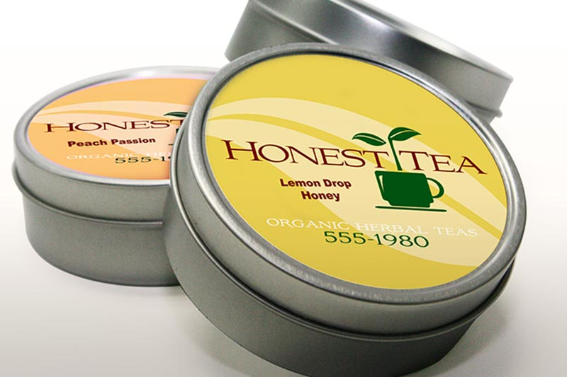

- Signage Printing and Vinyl Wrap  
    
  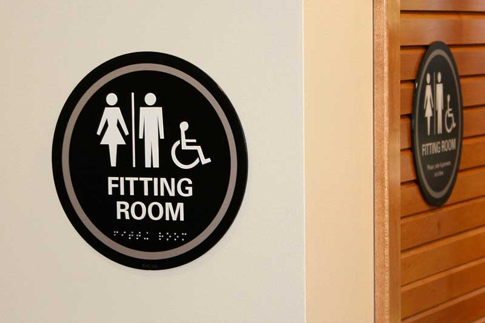

## Minimum knowledge to use machine

  
  
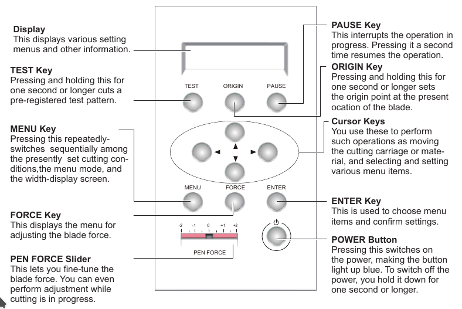  

- material size : width (50 - 700 mm), length (100m), roll (no restriction)
- don't load media that weight over 5kg
- material thickness of 0.1mm or less, 1mm maximum with carrier paper
- The pinch rollers must not extend beyond the grit marks  
  
- Align the left edge of the material so that it lies approximately parallel to the guide lines  
  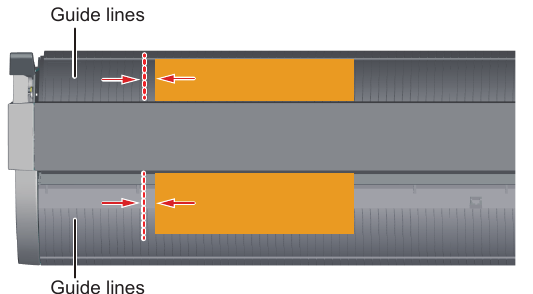
- The amount of blade extension can be adjusted by 0.1 mm for each scale mark on the cap, and by 0.5 mm for a full turn.  
  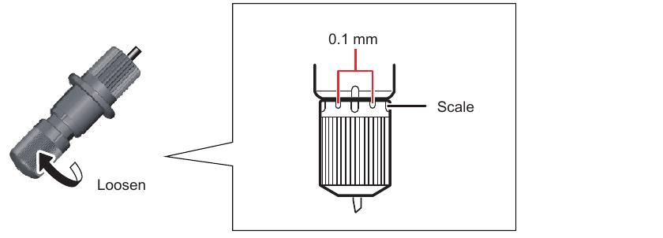
- File Formats that can be Imported into CutStudio
  - JPEG
    - JPEG files saved in CMYK format cannot be imported.
  - BMP
  - AI and EPS (Illustrator 8.0 versions)
    - Only Illustrator 8.0/EPS 8.0 versions can be imported. If using a higher version, save files as a lower version before importing
- softwares can be used
  - cut studio
  - Illustrator (plug-in required)
  - CorelDRAW (plug-in required)

## Materials

- Vinyl :  
  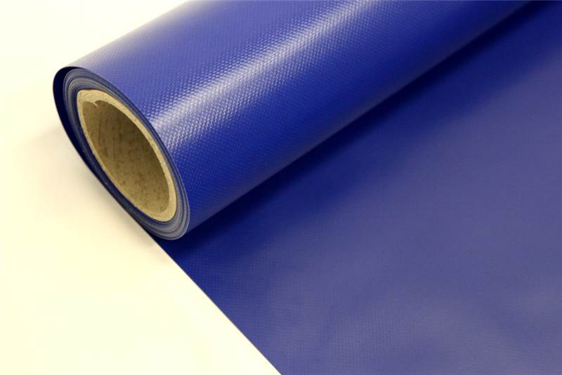

- Sandblast material :  
  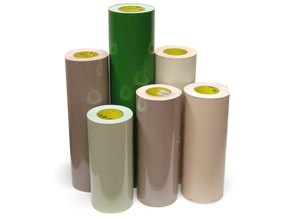

- Paint mask :  
  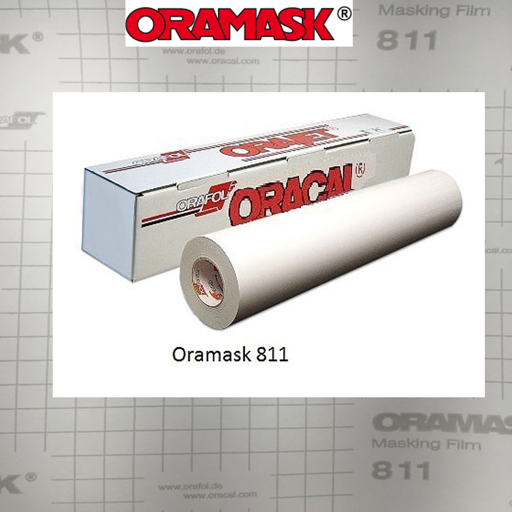

- Twill :  
  
- Heat transfer material :  
  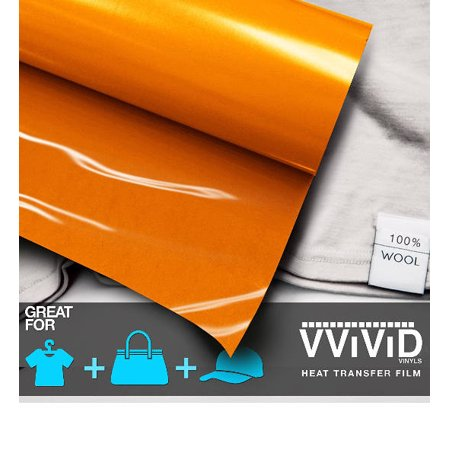

## Working time

- tuesday

## Maintenance

### Procedures

- Perform a Cutting Test
  - To obtain high-quality cutting results, carry out a cutting test to check the cutting quality for the material before you perform the actual cutting.
  - Check that the PEN FORCE slider is in its center setting  
    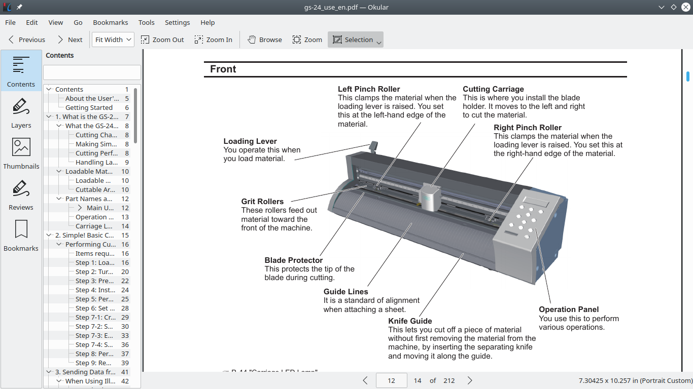
  - Hold down `test` key for one second or longer
  - The test pattern is cut  
    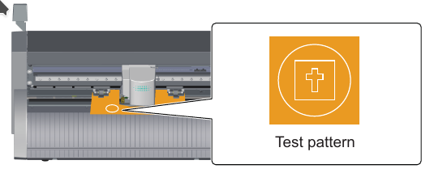
  - Peel off circle
    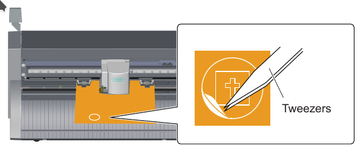  
    
  - Peel off rectangle  
    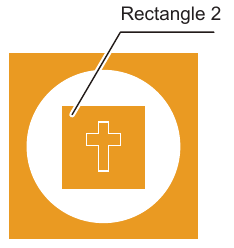  
    
- Cleaning the Machine
  - Items required : Cloth soaked in water and thoroughly wrung out  
     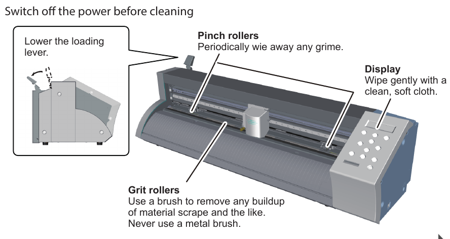
- Cleaning the Blade Holder Cap
  - If there is a buildup of material adhesive or dust inside the cap, loosen the cap, remove it, and remove any foreign matter. If pieces of material or dust build up inside the blade holder cap, the blade will stop turning smoothly and will no longer cut cleanly.

### Date

- Yearly maintenance
  - sunday `1\9\2019` hardware maintenance (cleaning)
  - monday `2\9\2019` software maintenance (installing O.S and softwares)
  - test the machine

## Advanced

- try crop marks method (marks as a guide)  
  
- try Cutting Perforated Lines (dotted lines)  
  
- try Tiled Output (large typing)  
  
- General Guide for Amount of Blade Extension  
  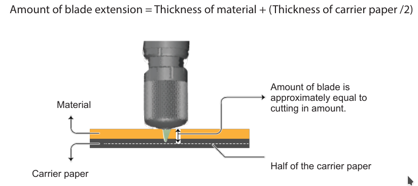
- Extending the Cutting Area (EXTEND) : It is possible to extend the cutting area by up to 20 mm.  
  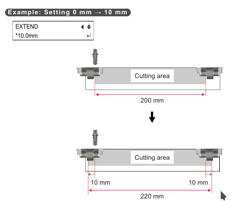
- Cutting Detailed Characters and Complex Shapes  
  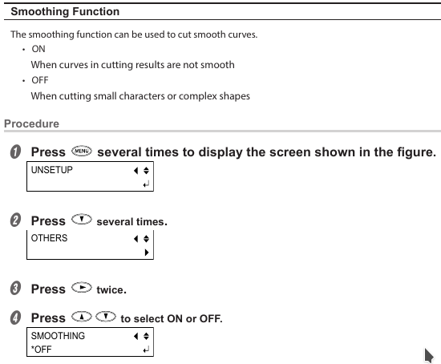
- Cutting in the Same Position Repetitively (Overlap)  
  
- Cutting Corners Cleanly (Over Cut) : This function cuts an extra 1 mm at the start and end of each line. It is effective when you want to produce particularly sharp corners, for example when cutting
  thicker materials. In most cases the over cut function should be set to "OFF." Set it to ON when you want to ensure that corners are cut cleanly.  
    
  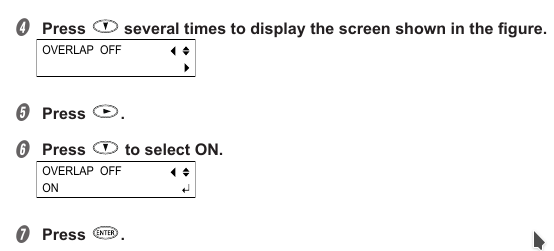
